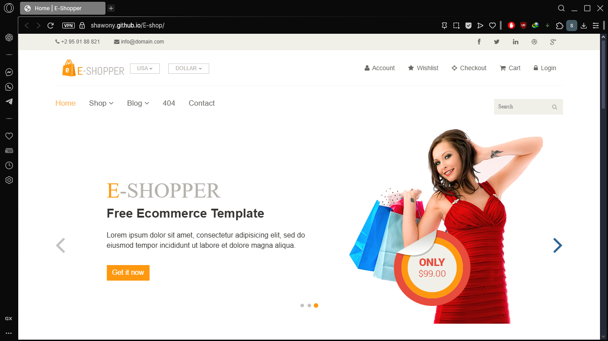
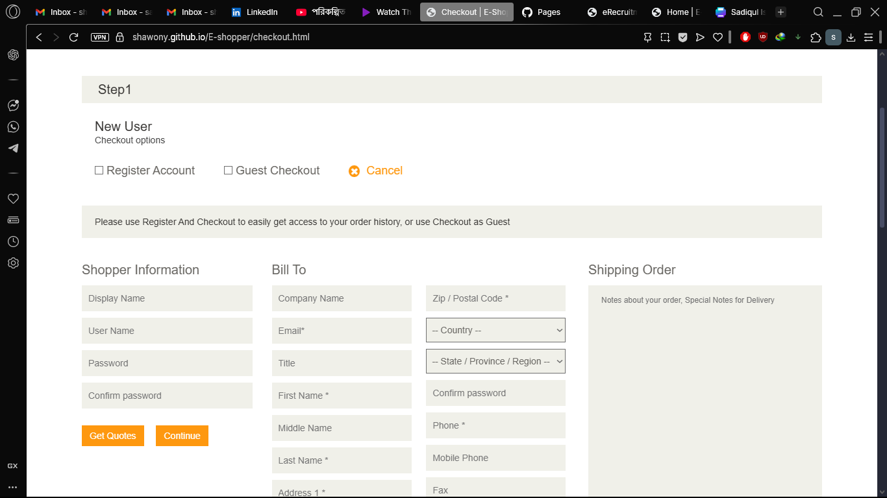
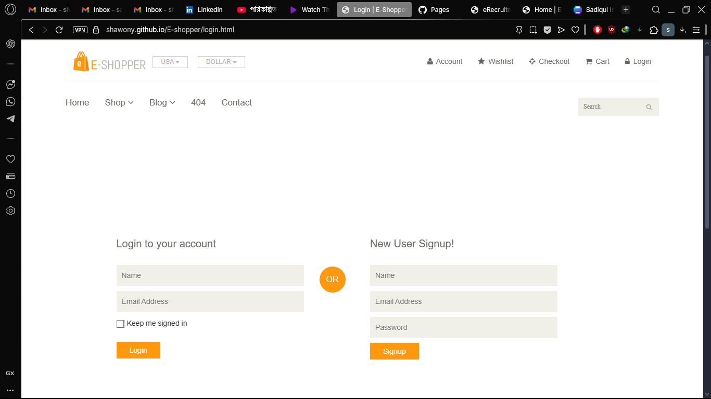
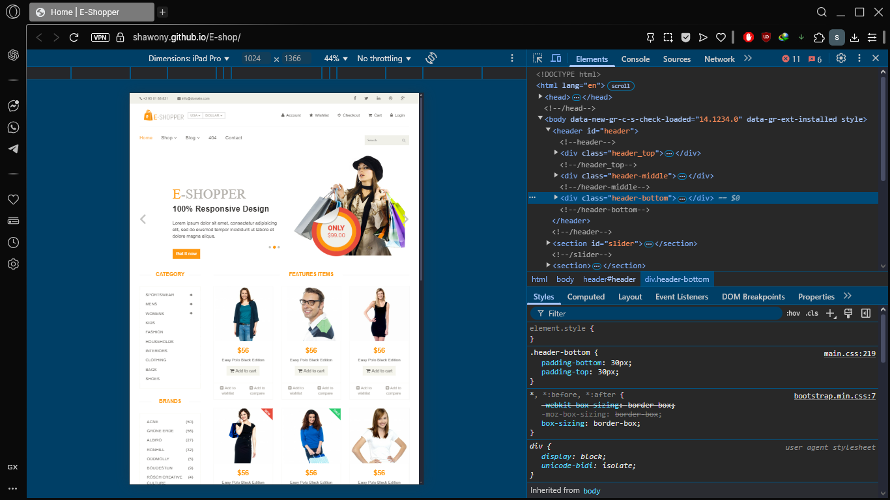
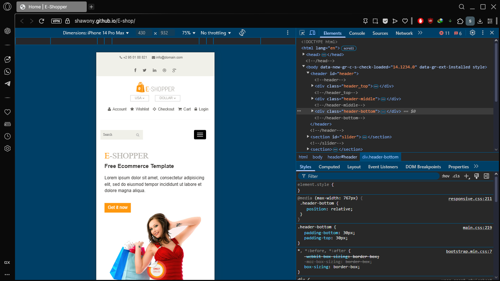

# E-Shopper

E-Shopper is a responsive and interactive e-commerce website built using HTML, CSS, JavaScript, and PHP. It showcases a clean layout with features like product listings, cart functionality, and user authentication, making it ideal for learning full-stack development.

## Features

- Fully responsive design for desktop and mobile
- Product catalog with images, prices, and descriptions
- Add to cart and cart management system
- User login and registration
- Admin dashboard to manage products (add, update, delete)
- Newsletter subscription form
- Contact form
- Interactive hover effects and animations

## Technologies Used

- HTML5
- CSS3
- JavaScript
- PHP
- MySQL (for backend database)

## Getting Started

1. Clone the repository:

   ```bash
   git clone https://github.com/your-username/E-shop.git
   ```

2. Place the project folder in your local server directory (e.g., `htdocs` if using XAMPP).

3. Start Apache and MySQL using XAMPP or a similar tool.

4. Import the included `.sql` file into phpMyAdmin to set up the database.

5. Run the project in your browser:
   ```
   https://shawony.github.io/E-shop/
   ```

## Screenshots







## License

This project was created for educational purposes only as part of a Programming Hero assignment.

## Author

Developed by Sadiqul Islam Shawn  
GitHub: https://github.com/Shawony
